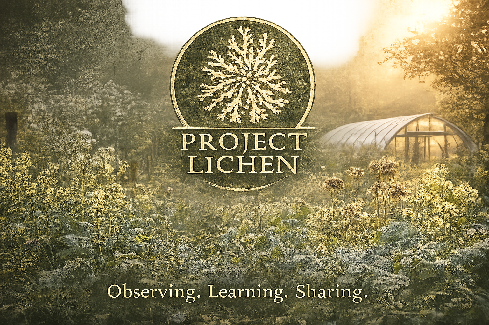

# Project Lichen

## Stewardship Across Generations — And What Capabilities Remain?

*Observe carefully.  
Learn continually.  
Share generously.*

---

Project Lichen is a framework for reconnecting living systems, energy systems, human coordination, land use, technology and governance into one coherent design.

It begins with observation, practical experiments and a deceptively simple question:

> **What capabilities remain?**

Project Lichen grew from years of practical work with seeds, soils, food production, water, biodiversity, pollinators, community and technology. It documents what we observe, preserves what we learn, and explores how those observations might help living systems and human communities remain capable across generations.

We believe that resilient communities begin with healthy soils, diverse and reproducible seeds, thriving pollinators, functioning ecosystems, accumulated knowledge and careful observation.

Every observation recorded today may become knowledge that benefits someone decades from now.

The project values **evidence over certainty and curiosity over conclusions**.

---

## Start Here

### 🌿 [Regenerative Capability](regenerative-capability.md)

What does it mean for a living system, person or community not merely to possess resources, but to retain the capability to produce, reproduce, adapt and share?

A seed provides a simple starting point.

### 🌎 [Alignment With Life](alignment-with-life.md)

What if success were measured not only by whether an objective was achieved, but by what capabilities remained—and what possibilities had been enlarged or extinguished—afterward?

### 🌍 [E-Cropolis](e-cropolis.md)

Can an existing city progressively recover living capabilities without ceasing to be a city?

E-Cropolis explores the possibility of a city learning to become a living system.

---

## Explore Project Lichen

- 🌿 [Origins & Evolution](about.md)
- 🌱 [Living Systems](living-systems.md)
- 🌿 [Regenerative Capability](regenerative-capability.md)
- 📓 [Field Notes](field-notes.md)
- 🌾 [Seed Library](seed-library.md)
- 🔬 [Research Library](research.md)
- 💻 [Technology](technology.md)
- 💻 [Data Distance](data-distance.md)
- 🌍 [E-Cropolis](e-cropolis.md)
- 🍲 [Recipes](recipes.md)
- 🌍 [The Commons](commons.md)
- 🌍 [Cooperatives](cooperatives.md)
- 🌎 [Alignment With Life](alignment-with-life.md)
- 🗺️ [Roadmap](roadmap.md)

---

## A Living Inquiry

Project Lichen is not presented as a finished prescription.

It is an evolving collection of observations, experiments, questions and practical work concerning regenerative horticulture, seed stewardship, biodiversity, fungi, soils, pollinators, food, climate resilience, technology and ecological participation.

Some ideas documented here are well established. Others are experiments. Some are propositions that we do not yet know how to test.

That distinction matters.

The intention is not to make everything fit a predetermined theory, but to observe relationships carefully enough that useful patterns can emerge.

> **Observe carefully. Learn continually. Share generously.**

---

## What Capabilities Remain?

A productive system can achieve its immediate objective while diminishing its ability to do so again.

A crop can produce food while degrading soil.

A city can create economic value while becoming increasingly dependent upon distant food, water, energy and material systems.

A technology can accomplish an objective while increasing the resources required to accomplish the next one.

Project Lichen is interested in another dimension of success:

> **What can the system still do afterward?**

Can the soil continue producing?

Can the seed reproduce?

Can water continue cycling?

Can knowledge be retained and shared?

Can communities adapt?

Can living systems continue evolving?

And, where possible:

> **Have those capabilities been enlarged?**

That question connects much of the work gathered here—from seeds and soils to cities, technology, economics and artificial intelligence.

---

**Project Lichen**  
*Stewardship Across Generations*
